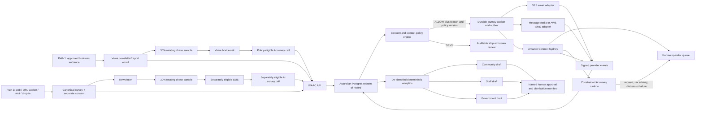

# IRAAC AI Contact Centre — Architecture Research and Recommendation

**Status:** proposed architecture for governance, legal and technical review

**Research date:** 31 July 2026

**Scope:** two coordinated pathways: approved Aboriginal-business value email
→ value brief → policy-eligible AI survey call, and citizen intake/consent →
newsletter → separately permitted SMS → separately permitted AI survey call;
plus rotating sampling, phone-assisted surveys, reporting and multi-agent
implementation.

This document is research and technical planning, not legal advice. No real
outreach is authorised by it.

## Executive decision

Use a **hybrid, provider-neutral architecture**:

1. IRAAC owns one Australian-hosted contact, provenance, consent, suppression,
   survey, campaign, audit and reporting system.
2. Amazon SES is the initial candidate for requested/consented newsletters
   because 10,000 messages cost roughly US$1 at its current base rate, before
   optional services and data. Do not assume SES will accept a cold public
   directory: production-access guidance expects recipients to have requested
   mail, so Path 1 needs a provider-acceptability and deliverability bake-off.
3. Sinch MessageMedia is the preferred SMS comparison because it offers an
   Australian gateway, two-way messaging and Australian sender-ID support.
   AWS End User Messaging remains the integrated comparison.
4. Amazon Connect Customer in Sydney is the recommended production
   contact-centre plane for human queues, progressive outbound calls, later
   approved automated voice, transfers, monitoring and operations.
5. Run a small Telnyx Australian Voice AI bake-off against Amazon Connect
   before selecting the autonomous AI voice engine.
6. Keep Twilio ConversationRelay as the programmable challenger, not the first
   production default.
7. Start with human-assisted calls. Add AI assistance to staff. Only then run
   a small, explicitly consented autonomous-AI pilot.

The key build-versus-buy line is:

> Buy telephony, carrier connectivity, queues, dialling, transfers and the
> human agent workspace. Build IRAAC's consent policy, deterministic survey
> state machine, Indigenous data controls, report logic and approvals.

## What the research confirms about consent and businesses

### Citizens

A citizen can give meaningful express permission for recurring AI survey calls
inside the survey. The person must actively select a separate, unticked,
voluntary choice that identifies IRAAC, AI/synthetic voice, purpose, expected
frequency, duration, withdrawal method, data use and human alternative.

The operational evidence is the **affirmative consent receipt**. Survey
completion without that affirmative choice is not enough. Permission for email,
SMS, a human call, an AI call and persistent recording/transcript storage are
separate. Autonomous voice still requires disclosed transient audio and
speech-to-text processing.

OAIC guidance says valid consent must be informed, voluntary, current and
specific, and given by a person with capacity. The DNCR Act's express-consent
rules also make stated duration important; legal counsel should decide whether
IRAAC uses a fixed duration or "until withdrawn" plus periodic
reconfirmation.

### Aboriginal-owned businesses

Australian/Aboriginal ownership is not a blanket licence for all channels.
However, the lawful pathway may be broader than ordinary consumer marketing:

- a number used primarily for business generally cannot be registered on the
  DNCR, while a mixed-use mobile may be eligible;
- all questionnaire/research calls still follow the Telemarketing and Research
  Calls Industry Standard;
- a purely factual non-commercial survey invitation may fall outside Spam Act
  commercial-message rules;
- conspicuous publication can support narrow inferred email consent only where
  publication was agreed, there is no no-solicitation statement and the
  message is relevant to the person's work;
- if IRAAC is currently an ACNC-registered charity, designated-message and
  designated-call exemptions may apply to particular content; and
- mixed promotion, donations, lead generation, services or newsletter content
  can change the classification.

Phase 0 must confirm IRAAC's current entity/ACNC status and classify the exact
one-time business invitation, recurring newsletter, value brief, linked pages
and research-only AI call. "Value-first" does not itself determine
classification; promotional content or linked pages can change it. Even where
an exemption exists, IRAAC should keep clear identity, source disclosure where
required, reply-capable opt-out, immediate suppression, limited attempts and
respectful contact hours as community-trust rules.

The default business pathway has two value-bearing emails and no SMS. An
unanswered email never creates voice permission. A business AI call must stay
within the approved research/questionnaire classification; promotional content
can make it dual-purpose or telemarketing.

## Platform comparison

Scores are directional, based on IRAAC's current size and needs. Final scoring
requires quotes, contracts and a technical proof of concept.

| Platform | Fit | Strong points | Main concerns | Role |
|---|---:|---|---|---|
| Amazon Connect Customer, Sydney | 9/10 | AU/NZ outbound coverage; progressive/predictive/automated voice; email/SMS journeys; human queues; AI agents; pay-as-used | AWS complexity; quotas/numbers; prove exact outbound-AI flow; AI regional processing and community speech accuracy | Recommended production contact-centre core |
| Telnyx Voice AI, Australia | 8/10 for AI voice | Strong current AU data-locality claim; Sydney media/GPU path; AU mobile voice/messaging | Less evidence of mature workforce/campaign governance than Connect; contractual verification needed | AI voice bake-off candidate |
| Twilio Voice + ConversationRelay + Flex | 8/10 | Highly programmable; AU1/Sydney voice region; low-latency STT/TTS transport; strong APIs | More custom campaign, agent, compliance and analytics work; product-by-product AU regionality; Flex cost | Challenger/prototype |
| Talkdesk | 7.5/10 | Managed proactive voice/SMS/email and Australian regional cloud | Quote pricing; less control; feature-specific subprocessors may leave Australia | Managed SaaS comparison |
| Genesys Cloud CX | 7.5/10 | Mature outbound, DNC/time controls, WEM, quality, APIs, Sydney region | Enterprise cost and operating weight | RFP/cost benchmark |
| NICE CXone Mpower | 7/10 | Excellent outbound/dialler, suppression, quality and workforce controls | Enterprise packages/add-ons; probably oversized | RFP benchmark |
| Five9 | 7/10 | Mature dial modes, DNC/abandonment controls and campaign APIs | Quote/integrator heavy | RFP benchmark |
| Microsoft Dynamics 365 Contact Center | 6.5/10 | Proactive AI, omnichannel, Teams/Power Platform integration, Australian availability | Licensing/platform migration; IRAAC is currently Google-centric | Use only after Microsoft standardisation |
| Google CCAI Platform/Dialogflow | 6.5/10 | Strong deterministic conversational flows, AI and testing; AU data-at-rest options | Australian PSTN/BYOC complexity; less complete email→SMS→voice journey | AI layer/comparison, not v1 core |
| Fully self-built media/RTP stack | 3/10 | Maximum control | IRAAC owns codecs, jitter, latency, transfers, failover, queues and compliance | Reject for v1 |

## Why Amazon Connect is the leading core

Official AWS documentation currently shows:

- outbound campaigns for agent-assisted voice, automated voice, email and SMS;
- multi-step/multi-channel journey building;
- progressive and predictive modes with answering-machine detection;
- communication windows, attempt limits and campaign metrics;
- Sydney-region outbound campaigns to Australian and New Zealand numbers;
- AI voice/self-service with an explicit human escalation path;
- MCP tools and AI-agent security profiles;
- live media, agent workspace, analytics, evaluation and KMS-encrypted storage.

The implementation still requires a proof of concept because AWS documents
automated outbound voice and AI self-service separately. The POC must prove the
exact combination in Sydney: Australian caller ID, answer-machine handling,
non-interruptible AI disclosure, survey tools, human transfer, call outcome,
quotas and complete data path.

AWS AI self-service documentation currently states an English-only limitation
for the relevant self-service type. "English supported" is not evidence that
Aboriginal names, places, accents and speaking styles will work. That must be a
community-tested quality gate.

AWS also documents cross-region inference for some AI features. IRAAC must get
the exact at-rest, in-transit, inference, logging, support and backup map in the
contract and request regional restrictions where available.

## Recommended system structure



Both lanes share the survey, policy, completion-correlation, suppression and
reporting core. They do not share assumed permission, cadence or templates.
The wider newsletter audiences remain separate from the rotating survey-chase
samples.

### System-of-record boundary

The contact-centre and messaging providers do not decide eligibility. IRAAC's
database holds:

- people and organisations as separate entities;
- pathway memberships and organisation-contact relationships;
- contact points and exact provenance;
- business-use/mixed-use evidence;
- consent wording and immutable consent events;
- suppressions, complaints, hard bounces and wrong-person events;
- surveys, versions, sessions and structured answers;
- survey/question/option/reporting-taxonomy reviews; Terms, Privacy Notice and
  response-use versions;
- campaign cycles, content artefacts/versions, audience snapshots, sample
  assignments, journeys/stages, survey invitations, completion correlations,
  terminal responses and attempts;
- provider events and call dispositions;
- report snapshots, derived views, versions, review threads/comments,
  approvals, publications and distributions;
- KPI definitions/snapshots, dashboard targets and trend-comparability
  decisions;
- incidents and append-only audit events.

The provider receives the minimum short-lived data needed for an approved
attempt. Provider callbacks are signature-checked, replay-safe and idempotent.

### Canonical survey and response store

Use one mobile-first survey application against a stable published instrument.
Next.js and SurveyJS Form Library provide the web experience. An IRAAC-owned
deterministic contract and execution engine—not the renderer—own question IDs,
validation, branching and session state. Supabase Postgres in Sydney stores the
governed records. Monthly priorities change analysis, reports and outreach;
they do not routinely change Have Your Say. Every response records pathway,
completion mode, survey/question/option versions and a campaign-cycle
completion key.

Use the survey and session lifecycles defined in `ROADMAP.md`. Campaigns and
started sessions pin one approved core release, including approved translation
and delivery-script releases. Partial/abandoned sessions are not completions and
are excluded from reports unless an approved methodology explicitly includes
and labels them. Critical withdrawal blocks submission and invokes a reviewed
recovery path; corrections always create a successor release. Web, staff,
human-phone and AI-phone adapters must pass identical branch and answer-shape
fixtures.

Separate identity/contact records from structured survey answers and give them
different access policies. The public form is anonymous/no-account by default;
contact details are optional unless follow-up is requested. It uses idempotent
server-side writes and cannot read response tables. Record service-Terms
acceptance where required, presentation of the Privacy Notice, the approved
core response-use basis, optional secondary-research consent and each optional
channel permission as distinct versioned events. Supabase RLS is enabled on
every exposed table; privileged keys remain server-side; report queries read
approved de-identified snapshots/views rather than contact rows.

### Report authoring and publication

One locked base dataset snapshot produces three audience-specific,
de-identified derived views and versioned artefacts:

- public business/community report and newsletter;
- private IRAAC/affiliate/partner management report; and
- private government advocacy report.

Metrics are deterministic. The LLM receives bounded de-identified outputs and
creates a draft/redline, never the source statistics. Review email contains a
signed expiring dashboard link. Free-text replies may be imported only as
untrusted comments; they never count as approval. Accepted comments create a
new report version and invalidate affected approvals.

After the required policy-defined approvals lock the dataset, narrative,
public artefact and recipient manifest, a production service may publish the
community version to
the public Reports index and distribute the other approved versions. The
public feed exposes only `audience=community_public` artefacts in
approved/published state. Government or staff material intended for public
release becomes a new community-public derivative with its own redaction and
approval cycle. The previous `insights.html` route remains a compatibility
redirect.

Reviewers approve only through authenticated or equivalently strongly verified
sessions; forwarded, expired or replayed notification links cannot approve.
Private reports use authenticated portal access or expiring recipient-bound
downloads, with no sensitive email attachment by default. Public publishing
has explicit build, deployed-unverified, verified, failure, retry and rollback
states so a failed release leaves the prior Reports index intact.

### Deterministic policy engine

Before audience selection, queueing and delivery, ask:

> May IRAAC perform this exact action, through this exact channel, for this
> exact person or organisation, for this exact purpose, at this time?

The engine evaluates cohort, provenance, message classification, channel,
human/AI type, consent/exemption and expiry, suppression, previous attempts,
frequency, quiet hours, number type/DNCR rule, campaign approval, audience hash
and policy version. Default is deny. Every decision has reason codes and
evidence references.

### Rotating sample and completion correlation

Create separate Path 1 and Path 2 survey-chase pools. The monthly 30% figure is
a configurable target/cap, not an independent random draw and not evidence of
representativeness. Use seeded, reproducible rotation without replacement, an
initial 90-day cooldown, organisation/household caps, capacity limits and
governance-approved strata. Record selection probability, inclusion/exclusion
reason, contact mode, response propensity and any weighting.

Newsletter membership is separate from survey-chase membership. Each monthly
newsletter uses one locked manifest containing 100% of the currently eligible,
deduplicated Path 1 and Path 2 email audience; controlled provider waves change
delivery timing, not coverage. Newsletter-specific unsubscribe does not revoke
a separately valid voice permission, but a global stop or safety suppression
does. Deduplication is deny-wins across all contributing records and uses one
canonical endpoint/purpose per campaign. A canonical
`campaign_cycle_completion_key` links web, QR, staff, SMS and phone completion
so any verified current-cycle completion or terminal response cancels every
controllable remaining chase step. Mode effects and non-response bias must be
tested before pooling channel results as though they were interchangeable.

### Deterministic AI survey

The LLM does not own question order, skip logic, consent, eligibility or
database writes. Caller speech, transient transcripts, retrieved content and
provider events are untrusted input. Every tool has a strict schema,
server-side authorisation, state-transition validation, argument allowlists,
timeouts and fail-closed behaviour. The model cannot alter policy, consent,
suppression, identity, survey order or tool permissions. It can use only
constrained tools:

- `get_next_question`
- `repeat_or_explain_approved` — governance-approved variants only
- `commit_answer`
- `correct_answer`
- `pause_resume`
- `withdraw`
- `request_human`
- `complete`

The survey state machine owns the truth. Each committed answer includes survey,
question, script and model versions, completion mode and confidence.

## Voice call state machine

```text
ELIGIBILITY_CHECK
  → DIAL_QUEUED
  → RINGING
  → ANSWER_CLASSIFY
      → VOICEMAIL / NO_ANSWER / WRONG_PERSON
      → AI_DISCLOSURE
      → CONSENT_RECONFIRM
      → SURVEY_Q[n]
      → ANSWER_CONFIRM / RETRY
      → COMPLETE
```

Global terminal or side states:

```text
WITHDRAWN
SUPPRESSED
HUMAN_TRANSFER
CALLBACK_BOOKED
LINK_SENT
FAILED_RETRYABLE
FAILED_FINAL
DISTRESS_ESCALATION
IMMEDIATE_SAFETY_ESCALATION
CAPACITY_OR_MINOR_STOP
```

From every conversational state, "stop", opt-out, human request, wrong person,
distress, low confidence or system failure interrupts normal flow.

### Safe failure behaviour

- Two low-confidence recognitions: approved repeat, DTMF, then human/link.
- Tool/model/WebSocket outage: preserve committed answers; apologise; offer
  callback or secure link; never restart at question one.
- Human unavailable: book a callback rather than hold indefinitely.
- Wrong person: reveal no sensitive reason; end and apply the approved
  verification/suppression process.
- Withdrawal: end immediately, record suppression, cancel IRAAC-queued work
  and attempt provider cancellation. Reconcile any provider-accepted race as
  `SUPPRESSED_AFTER_PROVIDER_ACCEPTANCE`.
- Voicemail: use only the approved minimal script; reveal no Aboriginal status
  or sensitive survey topic.
- Distress/safeguarding: bypass ordinary callback handling and use a
  Board-approved staffed priority transfer and deterministic safety script.
  Imminent danger follows the approved `000` pathway. If no trained person is
  available, end safely with approved wording and create a priority incident,
  not a routine callback. The AI does not assess risk, diagnose, or give legal
  or clinical advice.
- Capacity or minor concern: stop into the separately approved
  `CAPACITY_OR_MINOR_STOP` pathway; do not improvise consent.
- Unsafe/no model response: use a deterministic safe line or end the call.

## Rollout sequence

### Gate 0 — Governance and counsel

Confirm:

- IRAAC legal entity, ABN, ACNC status and APP coverage;
- exact citizen AI-call consent, duration and reconfirmation;
- business source licence/provenance and each content/channel classification;
- minor/capacity pathway;
- Indigenous Data Governance authority;
- privacy impact and AI impact assessments;
- recording/transcription position by state/territory;
- data map, DPA/subprocessors, retention/deletion and breach obligations;
- caller ID, SMS Sender ID, opt-out and complaint processes;
- human escalation and kill-switch owners.

### Gate 1 — Human-assisted foundation

Build the database, policy engine, survey state machine and agent console.
Progressive dial only a small approved, explicitly eligible cohort. Recording
is off. Verify parity between web, in-person and phone answers.

### Gate 2 — AI assists staff

Use deterministic script guidance, next-question support and structured
after-call notes. Do not let AI speak to citizens autonomously yet.

### Gate 3 — Internal autonomous AI

Use synthetic contacts and 20–50 staff/approved internal calls. A human
monitors. The AI cannot create external sends or reports.

### Gate 4 — Consented community pilot

Use 50–100 people who expressly opted into AI survey calls. Staff the human
queue. Recordings remain off unless separately approved. Manually review every
outcome.

### Gate 5 — Canary and scale

Use 1–5% of the eligible monthly cohort, daily review and automatic stop
thresholds. Scale only after governance approval. The 10,000-business cohort
has its own separately approved journey.

## Evaluation framework

Proposed IRAAC service levels, not vendor promises:

- first audible response p50 ≤ 1.2 s and p95 ≤ 2.0 s after end-of-turn;
- barge-in playback stop p95 ≤ 300 ms;
- no unexplained dead air > 2.5 s;
- ≥99% committed-answer persistence/restore;
- 100% mandatory AI disclosure;
- 100% immediate stop after opt-out;
- zero suppressed contacts dialled;
- ≥99% successful human transfer or callback capture;
- zero unapproved raw audio or persistent transcript retention.

Autonomous voice uses ephemeral audio buffers and transient speech-to-text.
Contracts and tests must prohibit provider training, verify regional
processing and deletion/retention, and prevent transcript persistence in logs
or handoff summaries unless separately approved.

Maintain at least 200 scripted regression scenarios covering:

- Australian and Aboriginal names and places;
- diverse accents, speaking speeds and line noise;
- overlap, silence, voicemail, DTMF-only and wrong person;
- partial completion, correction, pause and dropped call;
- withdrawal and human request;
- distress/safeguarding and abusive content;
- prompt injection and off-survey questions;
- model/tool/provider timeouts and duplicate events.

For every prompt, model, voice, provider, survey or policy change, rerun the
golden set and store versioned results. Automated quality scores triage; humans
judge compliance and cultural safety.

## Cost model

Use formulas, not a fixed budget:

```text
path1_newsletter_email_cost =
  approved_path1_newsletter_recipients × provider_email_rate

path1_value_brief_cost =
  selected_path1_chase_members_without_terminal_response × provider_email_rate

path2_newsletter_email_cost =
  consented_path2_newsletter_recipients × provider_email_rate

path2_sms_cost =
  selected_path2_chase_members_still_sms_eligible
  × segments_per_message × provider_sms_rate

human_voice_cost =
  connected_minutes × (contact_centre_rate + telephony_rate)
  + agent_hours × loaded_staff_rate

ai_voice_cost =
  separately_voice_eligible_path1_and_path2_connected_minutes
  × (contact_centre_or_ai_rate + telephony_rate)
  + model/tool usage

total =
  email + SMS + human voice + AI voice
  + phone numbers + storage + monitoring + support + engineering
```

Current public-price illustration only:

- 10,000 SES emails: about US$1 base sending;
- 3,000 Amazon Connect SMS platform events: about US$42, plus carrier/channel
  charges;
- 1,000 five-minute Amazon Connect calls: about US$190 contact-centre voice
  charge, plus telephony;
- the same 10,000 emails through Amazon Connect email: about US$800.

This is why bulk email should not use Connect by default. SES is not yet
approved for Path 1: its production-access process asks senders to acknowledge
that recipients requested the mail. The provider bake-off must test whether
the approved business source and message class meet provider acceptable-use
rules. The illustration is not a quote and excludes warm-up, authentication,
validation, deliverability tools, replies, attachments, SMS carrier fees,
telephone numbers, call termination, storage, support, staff and build cost.

For high-volume email, implement SPF, DKIM, DMARC, TLS, aligned From identity,
visible and one-click unsubscribe where applicable, paced warm-up, per-domain
throttling, Postmaster/reputation monitoring, immediate bounce/complaint
suppression and daily kill thresholds before approaching 10,000 recipients.

Do not select Amazon Pinpoint journeys. AWS has announced that Pinpoint
endpoints, segments, campaigns, journeys and analytics end support on 30
October 2026. Use IRAAC's durable workflow, Amazon Connect Customer for
approved multichannel execution and SES only where its policies fit.

Twilio's current Australia public pricing illustrates the programmable trade:
mobile outbound voice is listed at US$0.075/min and ConversationRelay at
US$0.07/min, before LLM and Flex charges. That makes it excellent for a
time-boxed quality comparison, not automatically the cheapest production
centre.

Sinch MessageMedia's published Australian packages currently range from 570
included SMS for A$45/month to 13,500 for A$789/month, with API access and
onshore routing claims. Obtain a not-for-profit/enterprise quote and contract
before selection.

## Architecture Decision Records required

1. `ADR-001` private repository and public/private boundary.
2. `ADR-002` Australian system of record and encryption.
3. `ADR-003` canonical consent and suppression event model.
4. `ADR-004` business-source and contact-policy rules.
5. `ADR-005` durable workflow/outbox.
6. `ADR-006` email provider and deliverability.
7. `ADR-007` SMS provider and reply-capable opt-out.
8. `ADR-008` contact-centre platform: Connect vs managed alternatives.
9. `ADR-009` AI voice engine: Connect vs Telnyx vs Twilio spike.
10. `ADR-010` recording/transcription and retention.
11. `ADR-011` LLM boundary and de-identification.
12. `ADR-012` report approval and distribution.
13. `ADR-013` observability, incidents and production kill switch.
14. `ADR-014` vendor exit/export and disaster recovery.

## Official source register

### Australian law and regulators

- [OAIC consent guidance](https://www.oaic.gov.au/privacy/australian-privacy-principles/australian-privacy-principles-guidelines/chapter-b-key-concepts)
- [OAIC APP 3 — collection](https://www.oaic.gov.au/privacy/australian-privacy-principles/australian-privacy-principles-guidelines/chapter-3-app-3-collection-of-solicited-personal-information)
- [OAIC APP 7 — direct marketing](https://www.oaic.gov.au/privacy/australian-privacy-principles/australian-privacy-principles-guidelines/chapter-7-app-7-direct-marketing)
- [OAIC APP 8 — cross-border disclosure](https://www.oaic.gov.au/privacy/australian-privacy-principles/australian-privacy-principles-guidelines/chapter-8-app-8-cross-border-disclosure-of-personal-information)
- [OAIC commercial AI privacy guidance](https://www.oaic.gov.au/privacy/privacy-guidance-for-organisations-and-government-agencies/guidance-on-privacy-and-the-use-of-commercially-available-ai-products)
- [Spam Act 2003](https://www.legislation.gov.au/C2004A01214/latest/text)
- [Do Not Call Register Act 2006](https://www.legislation.gov.au/C2006A00088/latest/text)
- [Telemarketing and Research Calls Industry Standard](https://www.legislation.gov.au/Latest/F2017L00323)
- [ACMA avoid sending spam](https://www.acma.gov.au/avoid-sending-spam)
- [DNCR industry standards](https://www.donotcall.gov.au/industry/industry-overview/industry-standards/)
- [DNCR registering numbers](https://www.donotcall.gov.au/consumers/register-your-numbers)
- [ACMA SMS Sender ID Register](https://www.acma.gov.au/industry-rules-sms-sender-id-register)
- [AIATSIS Code of Ethics](https://aiatsis.gov.au/sites/default/files/2020-10/aiatsis-code-ethics.pdf)
- [AIATSIS ethics application process](https://aiatsis.gov.au/research/ethical-research/application-process)
- [NHMRC National Statement 2025](https://www.nhmrc.gov.au/about-us/publications/national-statement-ethical-conduct-human-research-2025)
- [NIAA Framework for Governance of Indigenous Data](https://www.niaa.gov.au/resource-centre/framework-governance-indigenous-data)
- [ABS Labour Force Survey rotation methodology](https://www.abs.gov.au/statistics/detailed-methodology-information/concepts-sources-methods/labour-statistics-concepts-sources-and-methods/2023/methods-four-pillars-labour-statistics/household-surveys/labour-force-survey)

### Platforms and pricing

- [Amazon Connect Customer feature regions](https://docs.aws.amazon.com/connect/latest/adminguide/regions.html)
- [Amazon Connect outbound campaigns](https://docs.aws.amazon.com/connect/latest/adminguide/how-to-create-campaigns.html)
- [Amazon Connect outbound best practices](https://docs.aws.amazon.com/connect/latest/adminguide/outbound-campaign-best-practices.html)
- [Amazon Connect AI agents](https://docs.aws.amazon.com/connect/latest/adminguide/connect-ai-agent.html)
- [Amazon Connect agentic self-service](https://docs.aws.amazon.com/connect/latest/adminguide/agentic-self-service.html)
- [Amazon Connect voice best practices](https://docs.aws.amazon.com/connect/latest/adminguide/agentic-voice-best-practices.html)
- [Amazon Connect redaction limits](https://docs.aws.amazon.com/connect/latest/adminguide/sensitive-data-redaction.html)
- [Amazon Connect pricing](https://aws.amazon.com/products/connect/customer/pricing/)
- [Amazon SES pricing](https://aws.amazon.com/ses/pricing/)
- [Amazon SES production access requirements](https://docs.aws.amazon.com/ses/latest/dg/request-production-access.html)
- [Amazon Pinpoint end-of-support migration](https://docs.aws.amazon.com/pinpoint/latest/userguide/migrate.html)
- [Gmail sender requirements](https://support.google.com/mail/answer/81126)
- [Supabase Data API and RLS security](https://supabase.com/docs/guides/api/securing-your-api)
- [Twilio Australia voice pricing](https://www.twilio.com/en-us/voice/pricing/au)
- [Twilio ConversationRelay](https://www.twilio.com/docs/voice/twiml/connect/conversationrelay)
- [Twilio AU1 regional migration](https://www.twilio.com/docs/global-infrastructure/localized-uris/regional-migration-best-practices)
- [Telnyx Australia data locality](https://telnyx.com/release-notes/australia-data-locality)
- [Telnyx Sydney Voice AI](https://telnyx.com/release-notes/sydney-gpu-voice-ai-agents)
- [Sinch MessageMedia pricing](https://messagemedia.com/au/pricing/)
- [Sinch MessageMedia Australian SMS API](https://messagemedia.com/au/sms-api-gateway/)

### Production examples

These examples show common patterns, not evidence that their outcomes will
transfer to IRAAC:

- [GoStudent uses Amazon Connect profiles and outbound campaigns](https://aws.amazon.com/products/connect/customer/outbound/)
- [Australian AAMC adopted Amazon Connect incrementally](https://aws.amazon.com/solutions/case-studies/aamc-case-study/)
- [Google's own contact centre passes transcript/context to humans](https://cloud.google.com/blog/products/ai-machine-learning/how-google-cloud-improved-customer-support-with-contact-center-ai)
- [M&S combined Dialogflow automation with central human service](https://cloud.google.com/customers/marks-and-spencer/)
- [HBX automated text before tackling live voice](https://cloud.google.com/customers/hbx-group)
- [Trillet's Australian voice platform stresses sub-two-second latency and deterministic controls](https://cloud.google.com/customers/trilletai)

## Final recommendation

Approve a Phase 0 discovery and two-vendor technical bake-off, not a national
launch:

- Amazon Connect Sydney for the human contact-centre and main production
  comparison;
- Telnyx AU for autonomous Voice AI locality/quality;
- Twilio ConversationRelay for one short programmable latency benchmark if
  budget allows;
- SES for email;
- MessageMedia and AWS End User Messaging for SMS comparison;
- IRAAC-owned Australian Postgres policy/survey/report core throughout.

The decision is successful when IRAAC can replace any channel vendor without
losing consent evidence, survey truth, reporting lineage or the ability to stop
contact immediately.
