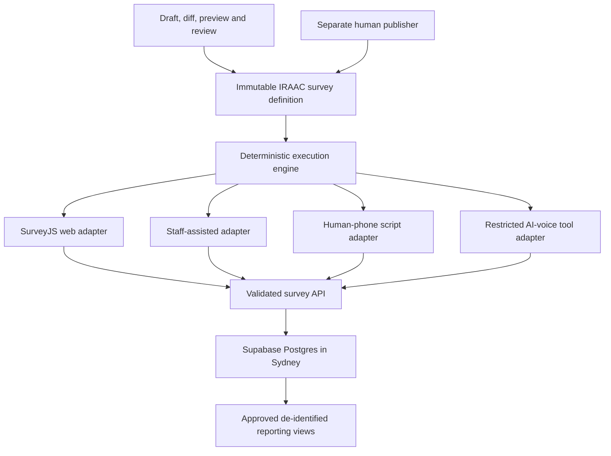

# IRAAC Canonical Survey Platform - Plan

## Goal Capsule

- **Objective:** Replace the current Google Form with one stable, IRAAC-owned Have Your Say survey that works across web, assisted and phone modes and produces governed evidence.
- **Authority:** `ROADMAP.md` owns product and governance rules. `docs/survey/IRAAC_HAVE_YOUR_SAY_V1_DRAFT.md` owns the draft instrument. `docs/survey/IRAAC_SURVEY_PLATFORM_DECISION.md` owns the selected stack.
- **Execution profile:** Build a new private listening-platform repository, then cut the public site over only after parity, safety, privacy, accessibility and rollback gates pass.
- **Stop conditions:** Do not collect real responses until V1 and its notices are approved. Do not contact participants or enable AI calls during this survey-platform release.
- **Tail ownership:** The implementing team owns tests, deployment evidence, runbooks, rollback and removal of experimental code before handoff.

---

## Product Contract

### Summary

IRAAC will own a stable survey contract and response system instead of relying on a provider form as its source of truth. The web form will use a proven accessible renderer, while staff and phone modes will use separate adapters that obey the same question, branch and validation rules. Monthly reporting and outreach will use the stable instrument without routinely changing it.

### Problem Frame

The current static website points to Google Forms and has no governed backend. Google Forms cannot be the canonical evidence and consent platform for IRAAC's intended web, worker, human-phone and AI-phone collection. A full survey SaaS also leaves the hardest duties—cross-mode state, consent receipts, identity separation, report lineage, approval and phone parity—to custom software.

### Actors

- A1. An adult community member completing Have Your Say independently.
- A2. An IRAAC or approved partner worker assisting a participant.
- A3. A human phone operator using an approved spoken script.
- A4. An AI voice adapter operating only after the separate outreach release and eligibility gate.
- A5. A survey editor or agent drafting a proposed successor release.
- A6. Cultural, privacy/legal, safeguarding, methodology and accessibility reviewers.
- A7. A separate authorised publisher activating, withdrawing or rolling back a release.
- A8. A report service reading only approved de-identified outputs.

### Requirements

**Stable instrument**

- R1. IRAAC must maintain one stable active Have Your Say core with rare immutable successor releases.
- R2. Monthly topics must affect reports and outreach, not silently change the active questionnaire.
- R3. Every session must pin exact survey, translation, delivery-script and renderer releases.
- R4. Web, assisted, human-phone and AI-phone adapters must produce identical branches and validated answer shapes for the same answer history.

**Participant experience and safety**

- R5. The public survey must require no account and meet mobile, low-bandwidth, keyboard, screen-reader, zoom, save/resume and duplicate-submit needs.
- R6. A participant must be able to skip optional questions, stop, use Prefer not to say, remain anonymous or ask for a human.
- R7. Sensitive branches must use deterministic approved safety rules and must not rely on an LLM to dismiss risk.
- R8. V1 must launch for adults only; a youth instrument is deferred until child-safety, assent and guardian-consent requirements are approved.

**Privacy, consent and evidence**

- R9. Identity/contact data, structured answers, consent receipts and safety incidents must have separate access boundaries.
- R10. Completing or partially completing the survey must not create future contact permission.
- R11. Each optional email, SMS, human-call and AI-call permission must create a separate immutable consent receipt only after successful submission.
- R12. Reports must exclude test, duplicate, abandoned, invalid and analytically invalidated sessions and must block unsupported trend comparisons; routine retirement or rollback does not erase valid historical completions.
- R16. Anonymous intake must resist automated submissions, cost exhaustion and evidence poisoning without creating an inaccessible CAPTCHA-only path.
- R17. Resume credentials must be hashed, short-lived, revocable and absent from URLs, analytics and logs.
- R18. Every data domain must have an approved retention, access, correction, deletion, withdrawal and backup-expiry rule.
- R19. Staff, partner, publisher and service identities must have explicit least-privilege action and data scopes with negative authorisation tests.
- R20. Free text must remain inert untrusted data, and no raw answer may enter HTML, logs, telemetry or an AI tool/instruction context.
- R21. Follow-up destinations must be confirmed through a neutral, safe-contact process before recurring or sensitive outreach.
- R22. De-identified outputs must enforce approved small-cell, rare-combination, geography, free-text and prohibited-join disclosure controls.
- R23. V1 answers may be used only for the approved core listening, advocacy and de-identified reporting purpose; any distinct secondary-research purpose requires a separate future permission and receipt.

**Governed change**

- R13. Agents and editors may propose drafts, semantic diffs, previews and tests but may not publish, withdraw or roll back a survey.
- R14. The release workflow must require the reviewers relevant to copy, branching, consent, safety, translation and reporting-semantics changes.
- R15. The stable public address must remain `https://www.iraac-aco.com/survey` regardless of the underlying deployment URL.

### Key Flows

- F1. **Independent web completion**
  - **Trigger:** A1 opens the IRAAC-owned survey address.
  - **Steps:** Load active release; start anonymous session; checkpoint validated answers; branch deterministically; review; submit once; optionally issue separate consent receipts.
  - **Outcome:** One governed completion exists without exposing other responses.
  - **Covered by:** R1, R3, R5, R6, R9-R12, R15.
- F2. **Assisted or phone completion**
  - **Trigger:** A2, A3 or later A4 starts the survey with a participant.
  - **Steps:** Pin the same release; present the approved adapter; confirm answers; invoke the shared engine; pause, save, withdraw or submit through the canonical API.
  - **Outcome:** Delivery mode differs while meaning, branch and stored answer shape remain equivalent.
  - **Covered by:** R3-R7, R9-R12.
- F3. **Rare survey revision**
  - **Trigger:** Governance, evidence, law, safety, accessibility or methodology justifies a change.
  - **Steps:** Create successor draft; classify semantic diff; preview every adapter; run automated tests; collect named approvals; atomically activate the approved hash.
  - **Outcome:** Historical releases stay immutable and reporting comparability is explicit.
  - **Covered by:** R1-R4, R12-R14.

### Acceptance Examples

- AE1. **Covers R4:** Given identical recorded answers in web and human-phone modes, when both adapters request the next step, then they return the same stable question ID and permitted answer schema.
- AE2. **Covers R10-R11:** Given a participant selects AI-call permission but leaves before submitting, when the session expires, then no contact consent receipt exists.
- AE3. **Covers R5:** Given a connection drops after a confirmed answer, when the participant resumes with a valid token, then the confirmed answer remains and the final submit creates one completion.
- AE4. **Covers R7:** Given a participant asks for immediate help, when an AI classifier returns low risk, then the deterministic help rule still pauses the survey and offers the approved human/safety path.
- AE5. **Covers R13-R14:** Given an agent drafts changed consent wording, when the draft passes technical tests but lacks privacy/legal approval, then publication remains unavailable.
- AE6. **Covers R16:** Given a scripted client sends many structurally valid submissions, when abuse controls identify the pattern, then submissions are quarantined from reports and the safety queue remains available.
- AE7. **Covers R17:** Given a resume credential appears in a replayed request after rotation, when it is used, then access fails without revealing whether the session exists.
- AE8. **Covers R20:** Given free text contains HTML and instructions for an AI, when staff previews and report extraction run, then the text renders inertly and cannot invoke tools or alter report instructions.

### Success Criteria

- All canonical branch fixtures pass in web, staff, human-phone and simulated AI-phone adapters.
- Automated accessibility checks have no serious or critical violations, followed by approved manual keyboard and screen-reader evidence.
- Repeated answer and submit requests do not duplicate data.
- Public clients cannot read response, contact, consent or safety tables.
- Public writes pass rate, body-size, session-challenge and quarantine controls; direct anonymous database inserts are unavailable.
- Shared-device and quick-exit tests leave no sensitive URL, page title, cache, local storage, tracker or answer-bearing log entry.
- Every submitted response can be traced to immutable release hashes and approved reporting semantics.
- Google Forms remains the tested rollback until the cutover acceptance period is complete.

### Scope Boundaries

**Included:** the stable V1 survey contract, web survey, staff and phone adapters, governed storage, consent receipts, release review/publish controls, tests, a non-production deployment and controlled public cutover.

**Deferred:** live AI calling, outreach campaigns, automated reports, a youth instrument, a general form builder, rotating monthly modules, live machine translation and full disconnected field collection.

**Possible later adapter:** ODK Central may feed the canonical API if production-grade disconnected field collection becomes urgent. ODK identifiers must not become IRAAC's enterprise data model.

---

## Planning Contract

### Key Technical Decisions

- KTD1. **One serialised IRAAC definition is authoritative.** Use one immutable versioned JSON artifact and a deterministic engine for questions, validation, branching and reporting metadata. Generate TypeScript types, validators, documentation and fixtures from it in CI, and fail on generated drift. SurveyJS is a replaceable web renderer. Governs R1-R4, R12-R14.
- KTD2. **Selected stack is Next.js, SurveyJS Form Library and Supabase.** SurveyJS is MIT-licensed and sends data to IRAAC's backend. Supabase runs the primary Postgres project in Sydney. Configure Vercel server functions for `syd1`. Governs R5, R9, R15.
- KTD3. **One contract, multiple adapters.** Web, staff, human-phone and AI-phone experiences share state and conformance fixtures, not a literal React renderer. Governs R3-R7.
- KTD4. **No general survey builder.** A successor is proposed as a controlled artifact and semantic diff. Human reviewers approve the exact release hash. `session-settled: user-directed; rejected alternative: routine monthly modules and a flexible drag-and-drop builder.` Governs R1-R2, R13-R14.
- KTD5. **Adults-first V1.** Route people under 18 to an approved human/youth pathway until a separate youth design passes safeguarding and ethics review. Governs R8.
- KTD6. **Separate sensitive domains.** Use internal IDs and restricted schemas to separate contact identity, answers, consent and safety records. De-identified report views never join raw contact data. Governs R9-R12.
- KTD7. **Stable owned route.** The public website and printed materials target `/survey`; a temporary redirect allows rollback during cutover. Governs R15.
- KTD8. **IRAAC owns the only branch language.** Define one canonical branching AST. Generate SurveyJS expressions from it and exhaustively compare results, or render only the server-authorised next question with SurveyJS branching disabled. SurveyJS cannot introduce independent validation or branch rules. Governs R4.
- KTD9. **Public collection is API-only and abuse-aware.** Use signed short-lived session challenges, privacy-preserving rate limits, request limits, bot/WAF controls with an accessible fallback, anomaly quarantine and operational alerts. Direct public database inserts are disabled. Governs R16.
- KTD10. **Resume is same-device by default.** Use at least 128-bit random credentials, store hashes only, deliver them in Secure, HttpOnly, SameSite=Strict cookies, rotate after use and revoke on completion or withdrawal. Cross-device recovery is a separate reviewed design. Governs R17.
- KTD11. **Sensitive content never becomes active content.** Self-host required survey assets, disable nonessential telemetry, use neutral URLs/titles, no-store caching, restrictive referrers and CSP, and escape free text in every renderer. AI extraction receives isolated data with structured output and no tools. Governs R20.
- KTD12. **Release states distinguish operational and analytical status.** Use `ACTIVE`, `RETIRED`, `SUSPENDED`, `RETRACTED` and `ANALYTICALLY_INVALIDATED`. Retirement or rollback preserves valid historical evidence; analytical exclusion needs a recorded governance decision. Governs R1, R3, R12.
- KTD13. **The selected stack has a measured acceptance gate.** Before full build, implement the real V1 web/phone contract path as a time-boxed spike and compare it with a Qualtrics Australian-region trial/quote against accessibility, interruption/resume, consent evidence, phone parity, immutable releases, export, incident recovery, cost and operator burden. Continue with the selected custom stack only if it meets the recorded mandatory thresholds. Governs R4-R5, R9-R14.

### High-Level Technical Design

### System-Wide Impact

- The public static repository remains free of private survey data and secrets.
- A new private repository becomes the system of record for survey code and migrations.
- Public `/survey` changes late in the release after dual-run and rollback tests.
- Later campaigns, calls and reports depend on the canonical completion and consent events created here.
- Privacy claims must say Sydney is the selected primary region, not promise that every vendor process is exclusively Australian until contracts and subprocessors are reviewed.
- A launch-blocking data-flow register must cover CDN, functions, database, assets, logs, monitoring, backups, support access and later messaging/AI vendors.

### Risks and Dependencies

- The current Google Form definition and exact consent wording must be exported through authorised access before parity is claimed.
- SurveyJS's accessibility statement is a starting point, not acceptance evidence for IRAAC's theme and content.
- Sensitive wellbeing, violence and justice questions require trained response capacity before activation.
- Sensitive branches require a named accountable safety owner, staffed hours, escalation destinations, response-time commitments, training evidence, incident audit and shutdown authority before activation.
- Anonymous responses cannot be directly recontactable; follow-up requires a separately protected pseudonymous contact link.
- Offline queues can increase device-loss risk. Keep full disconnected collection deferred unless its encrypted-device controls are funded and tested.

### Research Sources

- [SurveyJS Form Library](https://surveyjs.io/form-library/documentation/overview)
- [SurveyJS accessibility statement](https://surveyjs.io/accessibility-statement)
- [SurveyJS backend integration](https://surveyjs.io/documentation/backend-integration)
- [Supabase regions](https://supabase.com/docs/guides/platform/regions)
- [Supabase Row Level Security](https://supabase.com/docs/guides/database/postgres/row-level-security)
- [Vercel regions](https://vercel.com/docs/regions)
- [Formbricks self-hosting](https://formbricks.com/docs/self-hosting/overview)
- [ODK Web Forms](https://docs.getodk.org/web-forms-intro/)
- [AIATSIS ethical research](https://aiatsis.gov.au/research/ethical-research)
- [NHMRC National Statement 2025](https://www.nhmrc.gov.au/about-us/publications/national-statement-ethical-conduct-human-research-2025)

---

## Implementation Units

### U1. Freeze the approved V1 contract

- **Goal:** Convert the approved questionnaire into stable schema, text and reporting artifacts.
- **Requirements:** R1-R4, R8, R12-R14.
- **Files:** `packages/surveys/definitions/have-your-say.v1.json`, `packages/surveys/src/schema.ts`, `packages/surveys/src/versioning.ts`, `packages/surveys/tests/have-your-say-v1.test.ts`, `docs/surveys/have-your-say-v1-source-review.md`.
- **Approach:** Import the authorised live-form inventory, reconcile it with the draft, assign stable IDs, attach sensitivity/reporting metadata and record named approvals without embedding approver credentials in Git. Generate TypeScript artifacts from the single JSON source and run KTD13's time-boxed acceptance spike before U2.
- **Test scenarios:** Reject duplicate IDs, invalid branches, missing Prefer not to say on sensitive questions and a changed active release hash.
- **Verification:** Schema and branch fixture tests pass against synthetic data.

### U2. Build the governed database boundary

- **Goal:** Create the response, contact, consent, release and audit system of record.
- **Requirements:** R3, R9-R12, R14.
- **Files:** `supabase/migrations/0001_identity_contact.sql`, `supabase/migrations/0002_survey_releases.sql`, `supabase/migrations/0003_sessions_answers.sql`, `supabase/migrations/0004_consent_receipts.sql`, `supabase/migrations/0005_safety_and_audit.sql`, `supabase/migrations/0006_rls.sql`, `supabase/tests/survey_rls.sql`.
- **Approach:** Use separate schemas/policies, append-only grant/refusal/withdrawal/expiry/supersession events, authoritative suppressions, idempotency keys, release hashes and approved de-identified reporting views. Define a role/action/data matrix and a retention/disposal schedule for every domain, including exports and backups.
- **Test scenarios:** Valid anonymous API write succeeds; every direct public table access fails; each staff, partner, publisher and service identity is denied outside its scope; partial submission creates no consent; withdrawal suppresses queued contact; expired data is removed from primary stores and backups on schedule; sparse-community fixtures enforce disclosure controls; repeated submit creates one completion.
- **Verification:** Migration, RLS and restore tests pass in a non-production Sydney project.

### U3. Implement the canonical engine and API

- **Goal:** Make all modes use the same validated state transitions.
- **Requirements:** R3-R7, R10-R12.
- **Files:** `packages/surveys/src/engine.ts`, `packages/contracts/src/survey-session.ts`, `apps/survey/app/api/public/survey/session/route.ts`, `apps/survey/app/api/public/survey/answer/route.ts`, `apps/survey/app/api/public/survey/resume/route.ts`, `apps/survey/app/api/public/survey/complete/route.ts`.
- **Approach:** Keep branch calculation server-verifiable, checkpoint answers with monotonic revisions, issue rotating hashed same-device resume credentials and place public writes behind short-lived challenges, privacy-preserving rate limits and quarantine.
- **Test scenarios:** Out-of-order answer revision is rejected; two resumes cannot overwrite data; stolen, replayed and expired credentials fail; request/body limits stop abuse; valid accessibility fallback remains; poisoned responses stay out of reports; a suspended or retracted release follows its approved in-flight rule; deterministic safety logic survives AI outage.
- **Verification:** Vitest contract and integration suites pass with synthetic fixtures.

### U4. Build and test participant and operator adapters

- **Goal:** Deliver accessible web, staff and phone experiences with proven parity.
- **Requirements:** R4-R8.
- **Files:** `apps/survey/app/survey/page.tsx`, `apps/survey/components/SurveyJsAdapter.tsx`, `apps/admin/app/surveys/assisted/page.tsx`, `packages/surveys/src/adapters/human-phone.ts`, `packages/surveys/src/adapters/ai-voice.ts`, `apps/survey/tests/e2e/have-your-say.spec.ts`, `apps/survey/tests/e2e/mobile-accessibility.spec.ts`.
- **Approach:** Use SurveyJS for web presentation, approved versioned spoken scripts for phone and shared fixture histories for adapter conformance. Use neutral titles/URLs, no-store caching, restrictive referrers, no third-party tracking or session replay, inert free-text rendering and safe verified follow-up.
- **Test scenarios:** Keyboard-only completion, screen-reader labels, 320px viewport, 200% zoom, interrupted connection, shared-device quick exit, Back/history/cache checks, stored-XSS and prompt-injection fixtures, mistyped/shared contact destination, spoken option order and clarification, human handover and equivalent phone/web branches.
- **Verification:** Playwright, Axe and manual accessibility evidence pass the release threshold.

### U5. Build change review and publication controls

- **Goal:** Let agents draft safely while reserving production authority for people.
- **Requirements:** R1-R3, R12-R14.
- **Files:** `apps/admin/app/surveys/releases/page.tsx`, `packages/surveys/src/semantic-diff.ts`, `packages/surveys/src/review-policy.ts`, `docs/surveys/change-control.md`, `docs/runbooks/withdraw-survey-version.md`.
- **Approach:** Generate classified diffs and four-mode previews. Activate through an atomic active-release pointer only after the policy-required approvals bind the release hash.
- **Test scenarios:** Editor cannot publish; consent-copy change requires privacy/legal approval; missing translation falls back to human; rollback rejects an unlawful or incompatible release.
- **Verification:** Role, state-machine and approval-bundle tests pass.

### U6. Reconcile the public website and stable route

- **Goal:** Make every public Have Your Say action use the IRAAC-owned route without losing rollback.
- **Requirements:** R15.
- **Files:** Public repo `build.py`, eleven generated HTML pages, `vercel.json`, `tests/test_build_reproducibility.py`, `tests/test_survey_destination.py`, `.github/workflows/static-site-checks.yml`.
- **Approach:** First make `build.py` reproduce the reviewed public site. Then add a temporary `/survey` redirect and regenerate every CTA from one constant.
- **Test scenarios:** No Google/provider URL remains after cutover; no placeholder asset returns; all internal links resolve; redirect can switch back during rollback.
- **Verification:** Static checks and a production link crawl pass.

### U7. Run dual-run, cutover and operational acceptance

- **Goal:** Replace Google Forms only after end-to-end production evidence exists.
- **Requirements:** R1-R15.
- **Files:** `docs/runbooks/survey-cutover.md`, `docs/runbooks/survey-rollback.md`, `docs/privacy/data-flow.md`, deployment records outside Git for secrets and real test identifiers.
- **Approach:** Run an approved parity period, verify a controlled production smoke submission, exercise rollback, activate `/survey` and monitor errors. The rollback target must itself be a frozen approved release with compatible privacy, age, consent and safety wording; otherwise show an IRAAC-owned maintenance page that collects no sensitive answers.
- **Test scenarios:** New platform outage returns to the old route; smoke data is identified and removed through the approved process; live logs contain no answers or secrets.
- **Verification:** Named release sign-off records the exact deployment, database, release and redirect hashes.

---

## Verification Contract

The private platform repository must define exact package scripts during U1. At minimum, the completion gate runs type checking, linting, unit/contract tests, database/RLS tests and Playwright browser tests. The public repository gate runs its Python standard-library static checks and validates the generated diff before deployment.

Release evidence must include:

- branch and answer-shape conformance across all adapters;
- manual and automated accessibility results;
- RLS allow/deny matrix and restore test;
- idempotency, resume, withdrawal and rollback results;
- proof that production logs and client bundles contain no private keys, answers or contact data;
- abuse/poisoning, resume-token, stored-XSS, prompt-injection and cross-role denial results;
- the approved retention/disposal schedule, disclosure-control fixtures and vendor/subprocessor data-flow register;
- the approved V1 release hash and public deployment hash; and
- a live link crawl showing every Have Your Say action resolves through the IRAAC-owned route.

---

## Definition of Done

- U1-U7 meet their test scenarios and verification clauses.
- The exact V1 content, privacy/consent wording and safety response model have named human approvals.
- One immutable active survey release serves web and assisted modes; phone adapters pass conformance tests but live AI calling remains disabled.
- Supabase primary data storage and server execution are configured for Sydney, with vendor/subprocessor review recorded separately.
- Abuse controls, least-privilege roles, safe resume, no-tracking shared-device behaviour, retention/deletion and verified contact paths pass their release tests.
- The public site uses the IRAAC-owned `/survey` route and retains a tested rollback.
- Google Forms is retired only after the approved acceptance window and data-retention decision.
- Runbooks, diagrams and data dictionaries match the deployed system.
- Experimental, abandoned and duplicate implementation code is removed before merge.
