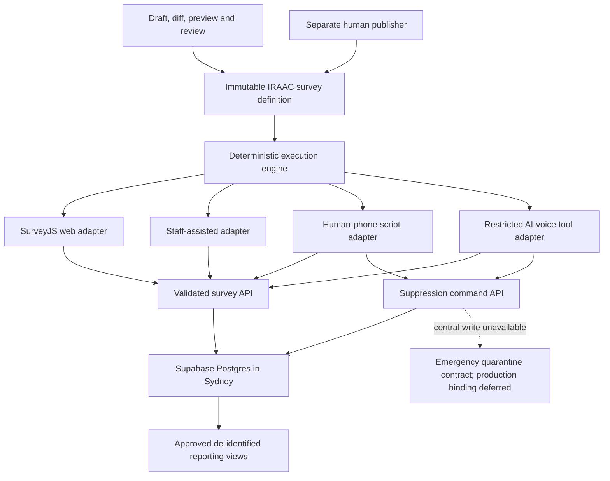

# IRAAC Canonical Survey Platform - Plan

## Goal Capsule

- **Objective:** Replace the current Google Form with one stable, IRAAC-owned Have Your Say survey that works across web, assisted and phone modes and produces governed evidence.
- **Authority:** `ROADMAP.md` owns product and governance rules. `docs/survey/IRAAC_HAVE_YOUR_SAY_V1_DRAFT.md` owns the draft instrument. `docs/survey/IRAAC_SURVEY_PLATFORM_DECISION.md` owns the selected stack.
- **Execution profile:** Build a new private listening-platform repository, then cut the public site over only after parity, safety, privacy, accessibility and rollback gates pass.
- **Stop conditions:** Do not collect real responses until V1 and its notices are approved. Both human-phone and AI-phone adapters are conformance simulators in this release; they receive no production telephony credentials or egress and may not contact real participants.
- **Tail ownership:** The implementing team owns tests, deployment evidence, runbooks, rollback and removal of experimental code before handoff.

---

## Product Contract

### Summary

IRAAC will own a stable survey contract and response system instead of relying on a provider form as its source of truth. The web form will use a proven accessible renderer, while staff and phone modes will use separate adapters that obey the same question, branch and validation rules. Monthly reporting and outreach will use the stable instrument without routinely changing it.

### Problem Frame

The current static website points to Google Forms and has no governed backend. Google Forms cannot be the canonical evidence and consent platform for IRAAC's intended web, worker, human-phone and AI-phone collection. A full survey SaaS also leaves the hardest duties—cross-mode state, consent receipts, identity separation, report lineage, approval and phone parity—to custom software.

### Actors

- A1. An adult community member completing Have Your Say independently.
- A2. An IRAAC or approved partner worker assisting a participant.
- A3. A human phone operator using an approved spoken script.
- A4. An AI voice adapter operating only after the separate outreach release and eligibility gate.
- A5. A survey editor or agent drafting a proposed successor release.
- A6. Cultural, privacy/legal, safeguarding, methodology and accessibility reviewers.
- A7. A separate authorised publisher activating, withdrawing or rolling back a release.
- A8. A report service reading only approved de-identified outputs.

### Requirements

**Stable instrument**

- R1. IRAAC must maintain one stable active Have Your Say core with rare immutable successor releases.
- R2. Monthly topics must affect reports and outreach, not silently change the active questionnaire.
- R3. Every session must pin exact survey, translation, delivery-script and renderer releases.
- R4. Web, assisted, human-phone and AI-phone adapters must produce identical branches and validated answer shapes for the same answer history.

**Participant experience and safety**

- R5. The public survey must require no account and meet mobile, low-bandwidth, keyboard, screen-reader, zoom, save/resume and duplicate-submit needs.
- R6. A participant must be able to skip optional questions, stop, use Prefer not to say, remain anonymous or ask for a human.
- R7. Sensitive branches must use deterministic approved safety rules and must not rely on an LLM to dismiss risk.
- R8. V1 must launch for adults only; a youth instrument is deferred until child-safety, assent and guardian-consent requirements are approved.

**Privacy, consent and evidence**

- R9. Identity/contact data, structured answers, consent receipts and safety incidents must have separate access boundaries.
- R10. Completing or partially completing the survey must not create future contact permission.
- R11. Each optional email, SMS, human-call and AI-call permission must create a separate immutable consent receipt only after successful submission.
- R12. Reports must exclude test, duplicate, abandoned, invalid and analytically invalidated sessions and must block unsupported trend comparisons; routine retirement or rollback does not erase valid historical completions.
- R16. Anonymous intake must resist automated submissions, cost exhaustion and evidence poisoning without creating an inaccessible CAPTCHA-only path.
- R17. Resume credentials must be hashed, short-lived, revocable and absent from URLs, analytics and logs.
- R18. Every data domain must have an approved retention, access, correction, deletion, withdrawal and backup-expiry rule.
- R19. Staff, partner, publisher and service identities must have explicit least-privilege action and data scopes with negative authorisation tests.
- R20. Free text must remain inert untrusted data. Authorised staff views may render it only as escaped plain text; raw answers must never be interpreted as HTML or copied into logs, telemetry, AI prompts or tool instructions.
- R21. Follow-up destinations must be confirmed through a neutral, safe-contact process before recurring or sensitive outreach.
- R22. De-identified outputs must enforce approved small-cell, rare-combination, geography, free-text and prohibited-join disclosure controls.
- R23. V1 answers may be used only for the approved core listening, advocacy and de-identified reporting purpose; any distinct secondary-research purpose requires a separate future permission and receipt.
- R24. V1 must end with an optional question asking what the survey missed or what issue IRAAC should explore. Participant copy must say it supports future community priorities, is not an emergency or individual-support channel, only successfully submitted text is reviewed and a personal reply is not guaranteed; immediate-help choices remain visible beside the field and submission confirms receipt. The answer enters human review and never mutates the active survey automatically. G05 collection pauses in new sessions when approved trained-review capacity or queue-age thresholds are exceeded.
- R25. The public footer may expose an Admin sign-in link only after a protected route exists; dashboard access must use named accounts, MFA and server/API/database authorisation, never a shared or client-side PIN.
- R26. Every phone adapter must expose a deterministic priority stop action. A
  spoken request to stop, not be called again or a statement that the number is
  on the Do Not Call Register must immediately end the call and append an
  endpoint-level IRAAC `VOICE_DO_NOT_CALL` suppression. The acknowledgement
  must say that IRAAC will stop calling and has added the number to IRAAC's
  internal do-not-call list; it must also make clear that IRAAC is not adding
  the number to the Australian Government's Do Not Call Register. A failed
  central write must still terminate and fail closed.
- R27. The approved bootstrap contact is `info@iraac-aco.com`. Provision its
  Auth identity only through an audited server-only, single-use invitation;
  never configure or reuse a password disclosed in planning. Treat that
  password as compromised and complete credential closure without retaining
  it. AAL1 may access setup-only routes; all dashboard data requires an
  authorised role plus AAL2. Interactive bootstrap sign-in requires one named
  custodian with documented exclusive mailbox control and an individual MFA
  factor; otherwise the mailbox is notification-only. Before production, at
  least two separately verified named administrators must be active and the
  bootstrap identity must be demoted to a non-interactive, no-data notification
  state with all sessions revoked.

**Governed change**

- R13. Agents and editors may propose drafts, semantic diffs, previews and tests but may not publish, withdraw or roll back a survey.
- R14. The release workflow must require the reviewers relevant to copy, branching, consent, safety, translation and reporting-semantics changes.
- R15. The stable public address must remain `https://www.iraac-aco.com/survey` regardless of the underlying deployment URL.

### Key Flows

- F1. **Independent web completion**
  - **Trigger:** A1 opens the IRAAC-owned survey address.
  - **Steps:** Load active release; start anonymous session; checkpoint validated answers; branch deterministically; review; submit once; optionally issue separate consent receipts.
  - **Outcome:** One governed completion exists without exposing other responses.
  - **Covered by:** R1, R3, R5, R6, R9-R12, R15.
- F2. **Assisted or phone completion**
  - **Trigger:** A2, A3 or later A4 starts the survey with a participant.
  - **Steps:** Pin the same release; present the approved adapter; confirm answers; invoke the shared engine; pause, save, withdraw or submit through the canonical API. A stop indication interrupts any phone step, invokes the authoritative suppression command and terminates without another survey question.
  - **Outcome:** Delivery mode differs while meaning, branch and stored answer shape remain equivalent; a phone stop creates a deny-wins canonical voice-endpoint suppression.
  - **Covered by:** R3-R7, R9-R12, R26.
- F3. **Rare survey revision**
  - **Trigger:** Governance, evidence, law, safety, accessibility or methodology justifies a change.
  - **Steps:** Create successor draft; classify semantic diff; preview every adapter; run automated tests; collect named approvals; atomically activate the approved hash.
  - **Outcome:** Historical releases stay immutable and reporting comparability is explicit.
  - **Covered by:** R1-R4, R12-R14.

### Acceptance Examples

- AE1. **Covers R4:** Given identical recorded answers in web and human-phone modes, when both adapters request the next step, then they return the same stable question ID and permitted answer schema.
- AE2. **Covers R10-R11:** Given a participant selects AI-call permission but leaves before submitting, when the session expires, then no contact consent receipt exists.
- AE3. **Covers R5:** Given a connection drops after a confirmed answer, when the participant resumes with a valid token, then the confirmed answer remains and the final submit creates one completion.
- AE4. **Covers R7:** Given a participant asks for immediate help, when an AI classifier returns low risk, then the deterministic help rule still pauses the survey and offers the approved human/safety path.
- AE5. **Covers R13-R14:** Given an agent drafts changed consent wording, when the draft passes technical tests but lacks privacy/legal approval, then publication remains unavailable.
- AE6. **Covers R16:** Given a scripted client sends many structurally valid submissions, when abuse controls identify the pattern, then submissions are quarantined from reports and the safety queue remains available.
- AE7. **Covers R17:** Given a resume credential appears in a replayed request after rotation, when it is used, then access fails without revealing whether the session exists.
- AE8. **Covers R20:** Given free text contains HTML and instructions for an AI, when staff previews and report extraction run, then the text renders inertly and cannot invoke tools or alter report instructions.
- AE9. **Covers R24:** Given a participant suggests a new topic in G05, when the survey is submitted, then the text enters the suggestion queue and the active release hash remains unchanged.
- AE10. **Covers R25:** Given an unauthenticated visitor follows the public Admin link, when they request dashboard data directly, then the server and database deny access and no secret is present in the public bundle.
- AE11. **Covers R26:** Given a recipient says "I am on the Do Not Call Register"
  during any phone-adapter state, when the stop guard detects it, then the
  adapter asks no further question, records `VOICE_DO_NOT_CALL` for the
  canonical endpoint, uses the approved IRAAC-internal-list acknowledgement
  and terminates; if the store is unavailable, it terminates, quarantines the
  endpoint and blocks retry.
- AE12. **Covers R27:** Given bootstrap provisioning begins, when setup
  completes, then the Auth identity was created only by the approved
  server-side invitation action; no password, invitation/session token or
  privileged key appears in repositories, builds, client configuration or
  logs; the disclosed password is rejected; AAL1 reaches setup routes only;
  two named AAL2 administrators are active; and the bootstrap principal is
  non-interactive, no-data and unable to use any stale session.

### Success Criteria

- All canonical branch fixtures pass in web, staff, human-phone and simulated AI-phone adapters.
- Automated accessibility checks have no serious or critical violations, followed by approved manual keyboard and screen-reader evidence.
- Repeated answer and submit requests do not duplicate data.
- Public clients cannot read response, contact, consent or safety tables.
- Public writes pass rate, body-size, session-challenge and quarantine controls; direct anonymous database inserts are unavailable.
- Shared-device and quick-exit tests leave no sensitive URL, page title, cache, local storage, tracker or answer-bearing log entry.
- Every submitted response can be traced to immutable release hashes and approved reporting semantics.
- Google Forms remains the tested rollback until the cutover acceptance period is complete.

### Scope Boundaries

**Included:** the stable V1 survey contract, optional missing-issue suggestion intake, web survey, staff adapter, conformance-only human-phone and AI-phone simulators, governed storage, consent receipts, release review/publish controls, protected named-account admin entry, tests, a non-production deployment and controlled public cutover.

**Deferred:** all live human and AI outbound calling, provider credentials and cancellation, outreach campaigns, automated reports, a youth instrument, a general form builder, rotating monthly modules, live machine translation and full disconnected field collection. A separate reviewed live-calling plan must select the provider and independent durable emergency-quarantine implementation before either phone mode receives production egress.

**Possible later adapter:** ODK Central may feed the canonical API if production-grade disconnected field collection becomes urgent. ODK identifiers must not become IRAAC's enterprise data model.

---

## Planning Contract

### Key Technical Decisions

- KTD1. **One serialised IRAAC definition is authoritative.** Use one immutable versioned JSON artifact and a deterministic engine for questions, validation, branching and reporting metadata. Generate TypeScript types, validators, documentation and fixtures from it in CI, and fail on generated drift. SurveyJS is a replaceable web renderer. Governs R1-R4, R12-R14.
- KTD2. **Selected stack is Next.js, SurveyJS Form Library and Supabase.** SurveyJS is MIT-licensed and sends data to IRAAC's backend. Supabase runs the primary Postgres project in Sydney. Configure Vercel server functions for `syd1`. Governs R5, R9, R15.
- KTD3. **One contract, multiple adapters.** Web, staff, human-phone and AI-phone experiences share state and conformance fixtures, not a literal React renderer. Governs R3-R7.
- KTD4. **No general survey builder.** A successor is proposed as a controlled artifact and semantic diff. Human reviewers approve the exact release hash. `session-settled: user-directed; rejected alternative: routine monthly modules and a flexible drag-and-drop builder.` Governs R1-R2, R13-R14.
- KTD5. **Adults-first V1.** Route people under 18 to an approved human/youth pathway until a separate youth design passes safeguarding and ethics review. Governs R8.
- KTD6. **Separate sensitive domains.** Use internal IDs and restricted schemas to separate contact identity, answers, consent and safety records. De-identified report views never join raw contact data. Governs R9-R12.
- KTD7. **Stable owned route.** The public website and printed materials target `/survey`; a temporary redirect allows rollback during cutover. Governs R15.
- KTD8. **IRAAC owns the only branch language.** Define one canonical branching AST. Generate SurveyJS expressions from it and exhaustively compare results, or render only the server-authorised next question with SurveyJS branching disabled. SurveyJS cannot introduce independent validation or branch rules. Governs R4.
- KTD9. **Public collection is API-only and abuse-aware.** Use signed short-lived session challenges, privacy-preserving rate limits, request limits, bot/WAF controls with an accessible fallback, anomaly quarantine and operational alerts. Direct public database inserts are disabled. Governs R16.
- KTD10. **Resume is same-device by default.** Use at least 128-bit random credentials, store hashes only, deliver them in Secure, HttpOnly, SameSite=Strict cookies, rotate after use and revoke on completion or withdrawal. Cross-device recovery is a separate reviewed design. Governs R17.
- KTD11. **Sensitive content never becomes active content.** Self-host required survey assets, disable nonessential telemetry, use neutral URLs/titles, no-store caching, restrictive referrers and CSP, and escape free text in every renderer. AI extraction receives isolated data with structured output and no tools. Governs R20.
- KTD12. **Release states distinguish operational and analytical status.** Use `ACTIVE`, `RETIRED`, `SUSPENDED`, `RETRACTED` and `ANALYTICALLY_INVALIDATED`. Retirement or rollback preserves valid historical evidence; analytical exclusion needs a recorded governance decision. Governs R1, R3, R12.
- KTD13. **The selected stack has a measured acceptance gate.** Build a thin U1-U3 vertical slice of the real V1 web/phone contract, then compare it with a Qualtrics Australian-region trial/quote against recorded mandatory thresholds for accessibility, interruption/resume, consent evidence, phone parity, immutable releases, export, incident recovery, cost and operator burden. Record the evidence and named go/no-go decision before U4, U5 or U8 expands the system. Governs R4-R5, R9-R14.
- KTD14. **Admin access is simple but attributable.** Use `https://admin.iraac-aco.com/login`, invite-only named Supabase Auth accounts, mandatory MFA, server-validated sessions and RLS-backed roles. Require recent step-up MFA for publication, withdrawal, rollback, invitation, role and privileged recovery actions; use dual control for publisher recovery, CSRF-resistant mutations, short-lived single-use invitations and immediate session revocation on removal. Add the public footer link only after DNS, TLS, callbacks, login and direct API-denial readiness pass. Reject a shared or static-site PIN because it is bypassable and cannot support individual audit. Governs R19, R25.
- KTD15. **Suggestions enter governance, not the survey.** G05 remains one inert canonical answer. Only final submission creates one suggestion workflow record referencing that answer, without copying the raw text; partial or abandoned text is not monitored. A named reviewer may link the record internally to an issue or write a neutral successor proposal through U5; the untrusted label persists and no suggestion alters an active definition. Every submitted non-empty G05 response enters trained human triage under approved staffed-hours, throughput, queue-age and response-time limits. Deterministic rules may raise priority but never dismiss safety risk, and an LLM cannot make that decision. Exceeding the safe backlog threshold disables G05 for new sessions and presents the human pathway. Governs R1-R2, R7, R20, R24.
- KTD16. **The suppression command, not a phone adapter, owns a stop.** A canonical voice endpoint is the provider-confirmed dialled Australian number normalised to E.164, represented in lookup indexes by a versioned HMAC-SHA-256 key whose secret is held in an approved key manager, and linked deny-wins across formatting variants, duplicates and shared-number records. Ambiguous regional inputs are quarantined rather than guessed; dual-read key rotation and collision/migration tests preserve existing stops. A service-authenticated, idempotent command resolves that endpoint, atomically appends `VOICE_DO_NOT_CALL`, updates the current deny projection and audit record, and returns an explicit committed or unavailable result. Phone runtimes may append idempotent stop events but cannot inspect or remove suppressions; campaign services receive allow/deny only; ordinary staff cannot enumerate raw endpoints. V1 implements and tests this provider-neutral contract against synthetic endpoints. The later live-calling release must bind it to an independently durable encrypted emergency outbox and provider cancellation. Re-import, contact merge and ordinary consent cannot clear a stop; any verified number-reassignment or explicit re-permission process is a separately approved future workflow requiring proof of endpoint control, a new channel-specific receipt, a named compliance role, recent MFA, dual approval and an append-only supersession event. Governs R9-R11, R19, R26.
- KTD17. **Phone adapters are non-production conformance simulators in V1.** Neither human-phone nor AI-phone code receives production telephony credentials, provider endpoints or outbound network egress. A server-side capability gate is disabled in every production environment, and build/deployment tests prove an origin call cannot be made. Live activation requires a separate approved implementation plan covering legal classification, consent, staff training, emergency quarantine, provider cancellation, incident response and production acceptance. Governs R4, R7, R26.
- KTD18. **Bootstrap access is invitation-only and expires into a no-data
  state.** Use one audited server-only `inviteUserByEmail` operator action with
  a secret-manager-held Supabase key and an exact allowlisted redirect; never
  pass a password. AAL1 is setup-only. The bootstrap role has an explicit deny
  on survey/contact/safety/report reads, exports, approvals, publication,
  arbitrary invitations, role grants, recovery and self-elevation. Interactive
  sign-in exists only for one recorded exclusive custodian; otherwise the
  mailbox is notification-only. After two separately verified named AAL2
  administrators pass role and recovery checks, atomically assign
  `bootstrap_notification_only`, revoke sessions/refresh tokens and reject
  stale claims from authoritative role/session-version state. Privileged
  recovery requires two named custodians and cannot be approved by the affected
  account. Governs R19, R25, R27.

### High-Level Technical Design

### System-Wide Impact

- The public static repository remains free of private survey data and secrets.
- A new private repository becomes the system of record for survey code and migrations.
- Public `/survey` changes late in the release after dual-run and rollback tests.
- Later campaigns, calls and reports depend on the canonical completion and consent events created here.
- Privacy claims must say Sydney is the selected primary region, not promise that every vendor process is exclusively Australian until contracts and subprocessors are reviewed.
- A launch-blocking data-flow register must cover CDN, functions, database, assets, logs, monitoring, backups, support access and later messaging/AI vendors.

### Risks and Dependencies

- The current Google Form definition and exact consent wording must be exported through authorised access before parity is claimed.
- SurveyJS's accessibility statement is a starting point, not acceptance evidence for IRAAC's theme and content.
- Sensitive wellbeing, violence and justice questions require trained response capacity before activation.
- Sensitive branches require a named accountable safety owner, staffed hours, escalation destinations, response-time commitments, training evidence, incident audit and shutdown authority before activation.
- Anonymous responses cannot be directly recontactable; follow-up requires a separately protected pseudonymous contact link.
- Offline queues can increase device-loss risk. Keep full disconnected collection deferred unless its encrypted-device controls are funded and tested.
- Live calling remains launch-blocked until a separate plan selects and proves
  an independently durable encrypted emergency-deny outbox, dispatch-epoch and
  final pre-provider suppression checks, provider cancellation/callback races,
  maximum interruption latency, phone-number reassignment governance and the
  legally/community-approved success and failure acknowledgements.

### Research Sources

- [SurveyJS Form Library](https://surveyjs.io/form-library/documentation/overview)
- [SurveyJS accessibility statement](https://surveyjs.io/accessibility-statement)
- [SurveyJS backend integration](https://surveyjs.io/documentation/backend-integration)
- [Supabase regions](https://supabase.com/docs/guides/platform/regions)
- [Supabase Row Level Security](https://supabase.com/docs/guides/database/postgres/row-level-security)
- [Supabase Auth](https://supabase.com/docs/guides/auth)
- [Supabase multi-factor authentication](https://supabase.com/docs/guides/auth/auth-mfa)
- [OWASP Authentication Cheat Sheet](https://cheatsheetseries.owasp.org/cheatsheets/Authentication_Cheat_Sheet.html)
- [OWASP Session Management Cheat Sheet](https://cheatsheetseries.owasp.org/cheatsheets/Session_Management_Cheat_Sheet.html)
- [Vercel regions](https://vercel.com/docs/regions)
- [Formbricks self-hosting](https://formbricks.com/docs/self-hosting/overview)
- [ODK Web Forms](https://docs.getodk.org/web-forms-intro/)
- [AIATSIS ethical research](https://aiatsis.gov.au/research/ethical-research)
- [NHMRC National Statement 2025](https://www.nhmrc.gov.au/about-us/publications/national-statement-ethical-conduct-human-research-2025)

---

## Implementation Units

### U1. Freeze the approved V1 contract

- **Goal:** Convert the approved questionnaire into stable schema, text and reporting artifacts.
- **Requirements:** R1-R4, R8, R12-R14, R24.
- **Files:** `packages/surveys/definitions/have-your-say.v1.json`, `packages/surveys/src/schema.ts`, `packages/surveys/src/versioning.ts`, `packages/surveys/tests/have-your-say-v1.test.ts`, `docs/surveys/have-your-say-v1-source-review.md`.
- **Approach:** Import the authorised live-form inventory, reconcile it with the draft, assign stable IDs, include G05 as the optional governed suggestion prompt, attach sensitivity/reporting metadata and record named approvals without embedding approver credentials in Git. Generate TypeScript artifacts from the single JSON source for KTD13's U1-U3 vertical slice.
- **Test scenarios:** Reject duplicate IDs, invalid branches, missing Prefer not to say on sensitive questions and a changed active release hash; accept a skipped G05; serialise and classify a supplied G05 response as inert suggestion data without changing the release.
- **Verification:** Schema and branch fixture tests pass against synthetic data.

### U2. Build the governed database boundary

- **Goal:** Create the response, contact, consent, release and audit system of record.
- **Requirements:** R3, R9-R12, R14, R19, R24-R26.
- **Files:** `supabase/migrations/0001_identity_contact.sql`, `supabase/migrations/0002_survey_releases.sql`, `supabase/migrations/0003_sessions_answers.sql`, `supabase/migrations/0004_consent_receipts.sql`, `supabase/migrations/0005_safety_and_audit.sql`, `supabase/migrations/0006_rls.sql`, `supabase/migrations/0007_suggestions.sql`, `supabase/migrations/0009_contact_suppressions.sql`, `supabase/tests/survey_rls.sql`, `supabase/tests/contact_suppressions.sql`.
- **Approach:** Use separate schemas/policies, append-only grant/refusal/withdrawal/expiry/supersession events, authoritative endpoint-level suppressions, idempotency keys, release hashes, a human-triaged suggestion queue and approved de-identified reporting views. `VOICE_DO_NOT_CALL` is deny-wins across human and AI phone modes and remains effective across contact merges, deletion/re-import and ordinary future consent. Define a role/action/data matrix and a retention/disposal schedule for every domain, including exports and backups. The workflow record follows the answer's correction, withdrawal, deletion and expiry state; it retains only the minimum audit tombstone after source removal. Reviewer summaries keep lineage and are re-reviewed or withdrawn when their source changes. An open safety incident follows its separately approved retention rule.
- **Test scenarios:** Valid anonymous API write succeeds; every direct public table access fails; each staff, partner, publisher and service identity is denied outside its scope; partial submission creates no consent; withdrawal suppresses queued contact; phone formatting variants and duplicate/shared contact rows resolve to the same `VOICE_DO_NOT_CALL`; deletion/re-import and ordinary later consent cannot reactivate it; expired data is removed from primary stores and backups on schedule while the minimum suppression tombstone remains; sparse-community fixtures enforce disclosure controls; repeated submit creates one completion; a non-empty G05 answer has exactly one linked suggestion workflow record while blank G05 creates none; correction, withdrawal, deletion and expiry update the workflow/summary state without an orphan or retained raw-text copy.
- **Verification:** Migration, RLS and restore tests pass in a non-production Sydney project.

### U3. Implement the canonical engine and API

- **Goal:** Make all modes use the same validated state transitions.
- **Requirements:** R3-R7, R10-R12, R24, R26.
- **Dependencies:** U1, U2.
- **Files:** `packages/surveys/src/engine.ts`, `packages/contracts/src/survey-session.ts`, `packages/contracts/src/contact-suppression.ts`, `apps/survey/app/api/public/survey/session/route.ts`, `apps/survey/app/api/public/survey/answer/route.ts`, `apps/survey/app/api/public/survey/resume/route.ts`, `apps/survey/app/api/public/survey/complete/route.ts`, `apps/survey/app/api/internal/contact-preferences/voice-stop/route.ts`, `apps/survey/tests/integration/voice-stop-route.test.ts`.
- **Approach:** Keep branch calculation server-verifiable, checkpoint answers with monotonic revisions, issue rotating hashed same-device resume credentials and place public writes behind short-lived challenges, privacy-preserving rate limits and quarantine. Add KTD16's service-authenticated, idempotent suppression command: accept the provider-confirmed dialled endpoint and call correlation, normalise and resolve it server-side, atomically append the stop/projection/audit state, and return deterministic committed/unavailable outcomes. The route is inaccessible to public or ordinary staff identities. The idempotent final-submission transaction keeps G05 in the canonical answer set and, when non-empty, creates exactly one suggestion workflow record that references the answer ID rather than copying its text. A failure rolls back completion so a retry can safely finish once.
- **Test scenarios:** Out-of-order answer revision is rejected; two resumes cannot overwrite data; stolen, replayed and expired credentials fail; request/body limits stop abuse; valid accessibility fallback remains; poisoned responses stay out of reports; a suspended or retracted release follows its approved in-flight rule; deterministic safety logic survives AI outage; absent, whitespace-only, deleted-before-submit and abandoned G05 text create no suggestion; disconnect/retry creates no duplicate; database failure creates neither a completion nor an orphan suggestion; sustained and burst submissions cannot starve legitimate safety triage; crossing the safe backlog threshold disables G05 for new sessions without hiding help routes; public, ordinary staff, replayed and malformed voice-stop commands fail; an authorised repeated command creates one effective deny state and returns the same result; a central-store timeout returns unavailable without falsely reporting success.
- **Verification:** Vitest contract and integration suites pass with synthetic fixtures. KTD13's comparison evidence and named go/no-go decision are recorded before dependent expansion begins.

### U8. Establish the admin authentication boundary

- **Goal:** Protect every staff and privileged route before an admin surface can be deployed.
- **Requirements:** R19, R25, R27.
- **Dependencies:** U2.
- **Files:** `apps/admin/app/login/page.tsx`, `apps/admin/app/auth/activate/page.tsx`, `apps/admin/app/auth/mfa/page.tsx`, `apps/admin/app/auth/recovery/page.tsx`, `apps/admin/middleware.ts`, `apps/admin/lib/auth.ts`, `supabase/migrations/0008_admin_roles.sql`, `supabase/tests/admin_auth.sql`, `apps/admin/tests/e2e/admin-auth.spec.ts`, `docs/design/admin-access-flow.md`, `docs/runbooks/admin-access-and-recovery.md`.
- **Approach:** Configure the dedicated admin origin, invite-only named accounts, mandatory AAL2 data access, server and database role checks, recent step-up for sensitive actions, CSRF-resistant mutations, account-change session rotation, short-lived invitations, dual-controlled recovery, removal revocation and audited lifecycle events. Implement KTD18 as one restricted server-only operator command using `inviteUserByEmail`, a secret-manager-held Supabase key, exact email/role/origin/callback bindings, custom SMTP and non-enumerating responses. It emits an append-only event with named operator, independent approver, target, role before/after, AAL, request/session identifier, timestamp and result, but no password, token, factor or key. AAL1 can reach only activation, password creation, MFA enrol/challenge, recovery status and sign-out. Role plus AAL2 is enforced at middleware, API and restrictive RLS before dashboard/data access. Record the exclusive custodian or make the mailbox notification-only; create and verify two named administrators; exercise dual control; then atomically demote the bootstrap principal, increment its session/auth version and revoke all sessions. Specify ordinary sign-in/out, invalid credentials, wrong-role/removal denial, session expiry, lost-factor request, dual-control recovery pending/approved/denied and safe support. Nothing under `apps/admin` is deployable until the denial matrix and bootstrap closure pass.
- **Test scenarios:** Invitation activation succeeds once; expired, wrong-recipient, wrong-role, wrong-origin and replayed invitations fail safely; login/invite/reset responses do not enumerate accounts; the bootstrap identity is created only from the restricted server action; the disclosed password is rejected and credential-closure evidence contains no secret; password, invite/session tokens, factors and Supabase keys are absent from source, generated assets, logs and deployment output; the service key never reaches a client or `NEXT_PUBLIC` value; AAL1 reaches setup routes only; MFA enrolment, challenge and session refresh work with keyboard and screen reader; bootstrap and notification-only roles cannot read/export survey, contact, safety or report data, publish, approve, invite, grant roles, recover accounts or self-elevate; two separate named AAL2 accounts satisfy role and dual-control checks; bootstrap demotion revokes refresh sessions and stale AAL2 tokens fail at API and RLS layers; invalid, expired, non-MFA, removed and wrong-role sessions cannot read data or call private APIs; password/MFA recovery requires two independent named approvers, replaces affected factors, revokes sessions, notifies the owner and cannot be approved by the affected account; forged cross-origin mutations, stale assurance, replayed approvals and concurrent artefact changes fail.
- **Verification:** The negative authorisation matrix passes at middleware, API and RLS layers on the verified admin origin.

### U4. Build and test participant and operator adapters

- **Goal:** Deliver accessible web, staff and phone experiences with proven parity.
- **Requirements:** R4-R8, R26.
- **Dependencies:** U3, U8.
- **Files:** `apps/survey/app/survey/page.tsx`, `apps/survey/components/SurveyJsAdapter.tsx`, `apps/admin/app/surveys/assisted/page.tsx`, `packages/surveys/src/adapters/human-phone.ts`, `packages/surveys/src/adapters/ai-voice.ts`, `apps/survey/tests/e2e/have-your-say.spec.ts`, `apps/survey/tests/e2e/mobile-accessibility.spec.ts`.
- **Approach:** Use SurveyJS for web presentation, approved versioned spoken scripts for phone and shared fixture histories for adapter conformance. Put a code-owned stop-intent guard and human-operator stop control ahead of normal phone dialogue in every state; the LLM may flag candidate wording but cannot continue, narrow or reverse a stop. Barge-in cancels generated speech, conservative interim-ASR and approved semantic patterns favour stopping over continuing, and the adapter invokes KTD16's command. On a committed result, the fixed acknowledgement is: "I'm sorry. I'm ending the call now. IRAAC has recorded that this number must not be called again. This is IRAAC's own list, not the Australian Government's Do Not Call Register. Goodbye." On an unavailable result it must not claim success: "I'm sorry. I'm ending the call now. IRAAC has blocked any retry and alerted our team to complete your request. Goodbye." It asks no further question and the simulator exercises the future emergency-quarantine contract. Enforce KTD17 with no production telephony secrets or egress and a server-side disabled capability. Use neutral titles/URLs, no-store caching, restrictive referrers, no third-party tracking or session replay, inert free-text rendering and safe verified follow-up. Operational logs retain only the suppression event ID, endpoint HMAC, rule/version ID, timestamp, call correlation and outcome; raw audio, transcripts, recognition alternatives and full stop phrases are excluded by default.
- **Test scenarios:** Keyboard-only completion, screen-reader labels, 320px viewport, 200% zoom, interrupted connection, shared-device quick exit, Back/history/cache checks, stored-XSS and prompt-injection fixtures, mistyped/shared contact destination, spoken option order and clarification, human handover and equivalent phone/web branches; direct and indirect stop phrases—including "I'm on the Do Not Call Register"—interrupt opening, consent, every survey question and closing; accent, noise, overlap, partial-utterance, paraphrase, low-confidence and negation fixtures prove the conservative recognition policy; generated speech stops within the approved latency after the guard emits; no further question is asked; human and AI modes use the same success or failure acknowledgement selected from the command result; a simulated write outage terminates, emits emergency-quarantine work and blocks retry; repeated stop events remain idempotent; logs contain no raw audio, transcript, recognition alternatives or full phrase; production has no credentials/egress and cannot originate a call.
- **Verification:** Playwright, Axe and manual accessibility evidence pass the release threshold; phone conformance evidence is synthetic only and proves the production-origin-call denial gate.

### U5. Build change review and publication controls

- **Goal:** Let agents draft safely while reserving production authority for people.
- **Requirements:** R1-R3, R12-R14, R19, R24-R25.
- **Dependencies:** U2, U8.
- **Files:** `apps/admin/app/surveys/releases/page.tsx`, `apps/admin/app/suggestions/page.tsx`, `packages/surveys/src/semantic-diff.ts`, `packages/surveys/src/review-policy.ts`, `docs/surveys/change-control.md`, `docs/runbooks/withdraw-survey-version.md`.
- **Approach:** Generate classified diffs and four-mode previews. Use `NEW → ACKNOWLEDGED → ASSIGNED → IN_REVIEW → SAFETY_ESCALATED | LINKED_TO_EXISTING | ACCEPTED_FOR_REVIEW | NO_CHANGE_NEEDED → CLOSED` for suggestion review, with owner, due time, permitted transitions, duplicate/related links, escalation destination, separate reviewer notes and final disposition. Define loading, empty, error, stale/concurrent-change and success states. Render suggestion source text only as escaped plain text, preserve its untrusted label and internal reference, and require a named reviewer to write any downstream neutral summary. Activate through an atomic active-release pointer only after the policy-required approvals bind the release hash and U8 authorises the action.
- **Test scenarios:** Queue loading, empty, error and retry states are accessible; assignment and each permitted disposition are audited; two reviewers cannot overwrite a newer decision; safety escalation reaches the approved destination and cannot be silently closed; editor cannot publish; suggestion cannot mutate the active release or enter an AI/tool context; stored HTML, malicious links and prompt instructions stay inert through linking; consent-copy change requires privacy/legal approval; missing translation falls back to human; stale MFA, forged mutation, replayed approval, concurrent change and unlawful rollback are denied.
- **Verification:** Role, state-machine and approval-bundle tests pass.

### U6. Reconcile the public website and stable route

- **Goal:** Make every public Have Your Say action use the IRAAC-owned route without losing rollback.
- **Requirements:** R15, R25.
- **Files:** Public repo `build.py`, eleven generated HTML pages, `vercel.json`, `tests/test_build_reproducibility.py`, `tests/test_survey_destination.py`, `.github/workflows/static-site-checks.yml`.
- **Approach:** First make `build.py` reproduce the reviewed public site. Then add a temporary `/survey` redirect and regenerate every CTA from one constant. Add Admin beneath Contact Us only after `https://admin.iraac-aco.com/login` passes its DNS, TLS, callback, login and unauthenticated API-denial readiness checks.
- **Test scenarios:** No Google/provider URL remains after cutover; no placeholder asset returns; all internal links resolve; redirect can switch back during rollback; Admin is absent before readiness, then opens only the login route; no password, PIN or bypass appears in generated HTML or JavaScript.
- **Verification:** Static checks and a production link crawl pass.

### U7. Run dual-run, cutover and operational acceptance

- **Goal:** Replace Google Forms only after end-to-end production evidence exists.
- **Requirements:** R1-R27.
- **Dependencies:** U1-U6, U8.
- **Files:** `docs/runbooks/survey-cutover.md`, `docs/runbooks/survey-rollback.md`, `docs/privacy/data-flow.md`, deployment records outside Git for secrets and real test identifiers.
- **Approach:** Run an approved parity period, verify a controlled production smoke submission, exercise rollback, activate `/survey` and monitor errors. The rollback target must itself be a frozen approved release with compatible privacy, age, consent and safety wording; otherwise show an IRAAC-owned maintenance page that collects no sensitive answers.
- **Test scenarios:** New platform outage returns to the old route; smoke data is identified and removed through the approved process; live logs contain no answers or secrets; cutover is blocked until two named AAL2 administrators pass role/recovery checks and the bootstrap principal is notification-only with stale sessions denied; synthetic phone evidence covers stop phrases, central-store outage, emergency-quarantine output, cancellation-race states and production-origin-call denial.
- **Verification:** Named release sign-off records the exact deployment, database, release and redirect hashes.

---

## Verification Contract

The private platform repository must define exact package scripts during U1. At minimum, the completion gate runs type checking, linting, unit/contract tests, database/RLS tests and Playwright browser tests. The public repository gate runs its Python standard-library static checks and validates the generated diff before deployment.

Release evidence must include:

- branch and answer-shape conformance across all adapters;
- manual and automated accessibility results;
- RLS allow/deny matrix and restore test;
- idempotency, resume, withdrawal and rollback results;
- proof that production logs and client bundles contain no private keys, answers or contact data;
- abuse/poisoning, resume-token, stored-XSS, prompt-injection and cross-role denial results;
- the approved retention/disposal schedule, disclosure-control fixtures and vendor/subprocessor data-flow register;
- the approved V1 release hash and public deployment hash; and
- a live link crawl showing every Have Your Say action resolves through the IRAAC-owned route;
- auth denial tests for unauthenticated, expired, non-MFA and wrong-role sessions; and
- proof that G05 suggestions enter human review without changing the active release hash.
- phone-adapter evidence that every stop phrase causes immediate termination,
  canonical endpoint suppression and no retry, including the fail-closed
  quarantine path.

---

## Definition of Done

- U1-U8 meet their test scenarios and verification clauses.
- The exact V1 content, privacy/consent wording and safety response model have named human approvals.
- One immutable active survey release serves web and assisted modes; both phone adapters pass only synthetic conformance tests and all live human/AI outbound calling remains disabled.
- Phone adapters implement the reviewed `VOICE_DO_NOT_CALL` interrupt and
  cannot claim to register a number on the Australian Government's Register.
- Supabase primary data storage and server execution are configured for Sydney, with vendor/subprocessor review recorded separately.
- Abuse controls, least-privilege roles, safe resume, no-tracking shared-device behaviour, retention/deletion and verified contact paths pass their release tests.
- The public site uses the IRAAC-owned `/survey` route and retains a tested rollback.
- The public Admin link appears only with a verified protected sign-in route; all dashboard access is attributable to named MFA-protected accounts.
- The approved bootstrap contact is provisioned through managed Auth,
  rejects the disclosed password, allows AAL1 setup only, exposes no secret,
  activates two named AAL2 administrators, and is non-interactive/no-data with
  all sessions revoked before production.
- G05 is optional, its text is handled as untrusted data, and accepted suggestions still require the normal governed survey-change process.
- Google Forms is retired only after the approved acceptance window and data-retention decision.
- Runbooks, diagrams and data dictionaries match the deployed system.
- Experimental, abandoned and duplicate implementation code is removed before merge.
